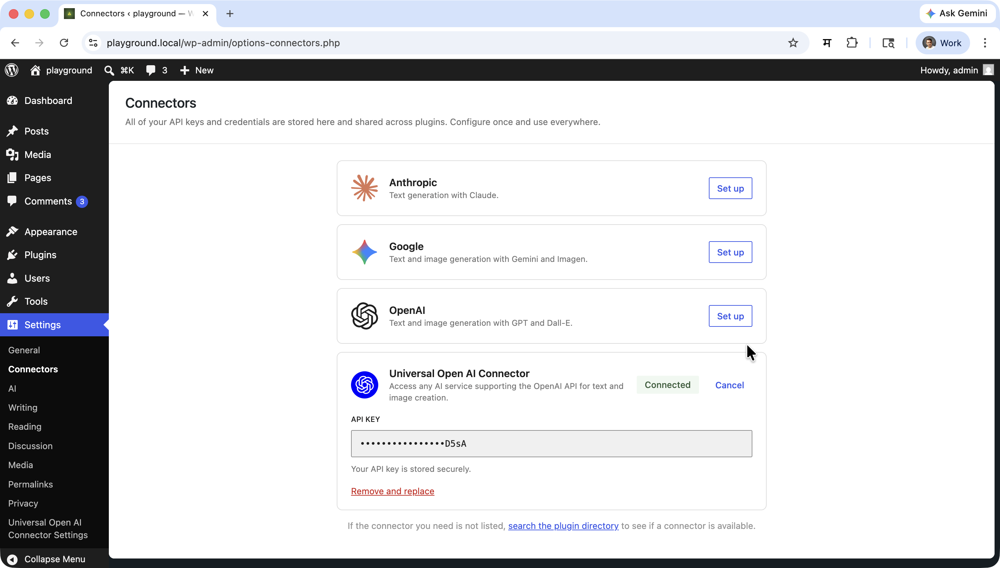
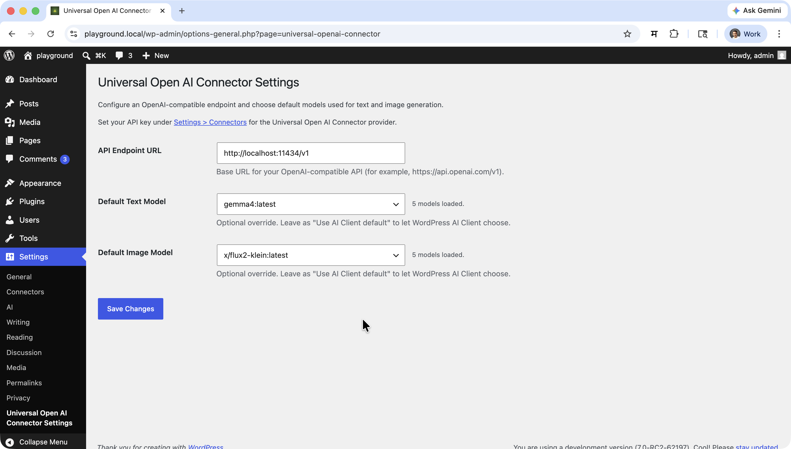
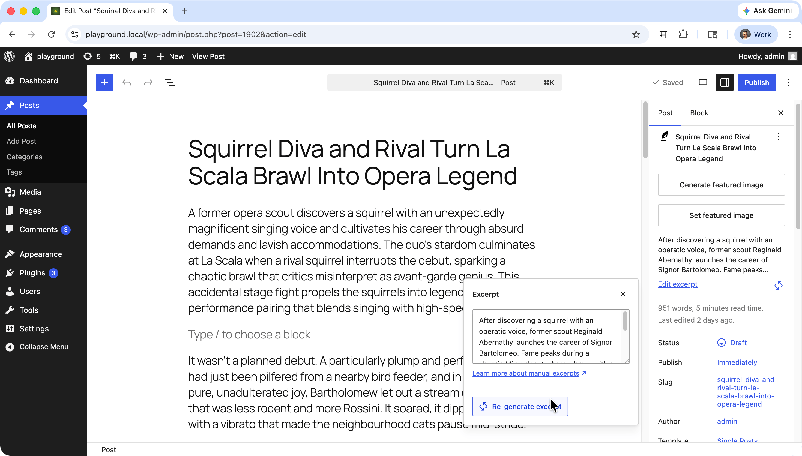
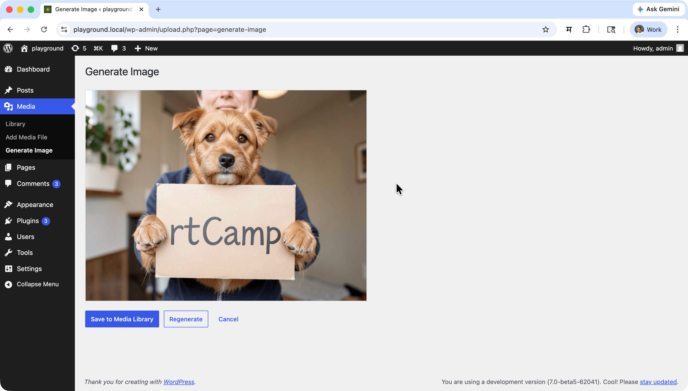

# Universal OpenAI Connector - Connect Any OpenAI-Compatible API to WordPress

**Contributors:** [rtCamp](https://profiles.wordpress.org/rtcamp/), [milindmore22](https://profiles.wordpress.org/milindmore22), [vishal4669](https://profiles.wordpress.org/vishal4669/), [aviralmittal89](https://profiles.wordpress.org/aviralmittal89/)

**Tags:** WordPress, AI, OpenAI, LLM, Text Generation, Image Generation, Self-hosted, Local AI, Ollama, Groq

This plugin is licensed under the GPL v2 or later.

## Overview

Universal OpenAI Connector registers an `openai_compatible` provider with the WordPress AI Client so that **any OpenAI-compatible API** can power AI features across WordPress — text generation, chat, and image generation included.

## Description

**Universal OpenAI Connector** bridges the WordPress AI Client with any OpenAI-compatible REST API, allowing you to:

* **Connect to any OpenAI-compatible endpoint** — official OpenAI, self-hosted, or third-party
* **Generate text** using any LLM accessible through the configured endpoint
* **Generate images** using models that support that supports images generations
* **Configure default models** for text and image generation from WordPress admin settings
* **Discover available models** automatically from your configured endpoint
* **Switch endpoints and models** without changing any code — just update your admin settings

This makes it simple to integrate any OpenAI-compatible API into your WordPress site while keeping full control over which service and models you use.

## Why Universal OpenAI Connector?

Many teams need the flexibility to swap AI providers without being locked into a single service — for cost, privacy, compliance, or feature reasons. This plugin handles that by:

- **Provider-agnostic:** Point at OpenAI, Ollama, LM Studio, Groq, Mistral AI, or any compatible service
- **Local inference support:** Works with self-hosted servers; WordPress HTTP restrictions for local URLs are resolved automatically
- **Standardized interface:** All models exposed through the WordPress AI Client's consistent API
- **Flexible configuration:** Switch endpoints and models from admin settings — no code changes required
- **Automatic model discovery:** Dropdowns are populated by querying the `/models` endpoint of your configured API

### Key Benefits

- **Provider freedom:** Change AI providers by updating a single URL in settings
- **No lock-in:** Use the official OpenAI API today, switch to a local Ollama instance tomorrow
- **Cost control:** Route requests to cheaper or self-hosted models as needed
- **Vision support:** Use multimodal models for image + text prompts
- **Image generation:** Full support for text-to-image models
- **Simple setup:** Enter an endpoint URL and API key to start generating

### API Integration

The plugin communicates using the standard OpenAI REST API format:

| Endpoint | Purpose |
|---|---|
| `GET /v1/models` | Populate the model dropdowns in settings |
| `POST /v1/chat/completions` | Text generation requests |
| `POST /v1/images/generations` | Image generation requests |

### Supported endpoints (examples)

| Service | Example base URL |
|---|---|
| OpenAI | `https://api.openai.com/v1` |
| Ollama | `http://localhost:11434/v1` |
| LM Studio | `http://localhost:1234/v1` |
| LocalAI | `http://localhost:8080/v1` |
| Mistral AI | `https://api.mistral.ai/v1` |
| Together AI | `https://api.together.xyz/v1` |
| Groq | `https://api.groq.com/openai/v1` |
| Fireworks AI | `https://api.fireworks.ai/inference/v1` |
| Xiaomi AI | `https://api.ai.xiaomi.com/v1` |

Any service that implements the OpenAI REST API (`/v1/chat/completions`, `/v1/images/generations`, `/v1/models`) should work.

### Limitations

- Only models registered through the configured endpoint are available; models from other providers are not mixed in.
- When the endpoint is not `api.openai.com`, strict OpenAI-only parameters (`response_format`, `n`, `quality`, `style`, `reasoning_effort`) are stripped automatically to improve compatibility with non-OpenAI backends.

## System Requirements

- **WordPress:** 7.0 or higher
- **Requires at least:** 7.0
- **Tested up to:** 7.0
- **Stable tag:** 1.0.1
- **PHP:** 7.4 or higher
- **Requires PHP:** 7.4
- **Required Plugin:** [WordPress AI Client](https://wordpress.org/plugins/ai/) (`ai`) must be active

## Installation & Setup

### As a WordPress Plugin

1. Ensure the **WordPress AI Client** plugin (`ai`) is installed and activated.
2. Clone or download this plugin into `wp-content/plugins/universal-openai-connector`.
3. Activate **Universal OpenAI Connector** from the Plugins screen.
4. Go to **Settings → Connectors** and enter your API key for the *Universal OpenAI Connector* provider.

5. Go to **Settings → Universal OpenAI Connector** and enter your **API Endpoint URL**.

6. Optionally select a **Default Text Model** and **Default Image Model** from the auto-populated dropdowns.
7. Save settings.

### As a Composer Package

```bash
composer require rtcamp/universal-openai-connector
```

## Usage Guide

### Accessing the Settings

Navigate to **Settings → Universal OpenAI Connector** in your WordPress admin to configure the plugin.

### Configuring Universal OpenAI Connector

#### Setting Up Authentication (Optional)

For services that require an API key:

1. Go to **Settings → Connectors**.
2. Enter your API key under the *Universal OpenAI Connector* provider and save.

For local servers that do not require authentication, leave the field blank.

#### Setting the Endpoint URL

The plugin connects to `https://api.openai.com/v1` by default. To use a different service:

1. Navigate to **Settings → Universal OpenAI Connector**.
2. Enter the base URL of your API in the **API Endpoint URL** field (e.g. `http://localhost:11434/v1` for Ollama).
3. Save your settings.

You can also override the endpoint via the `OPENAI_COMPATIBLE_BASE_URL` environment variable — this takes priority over the admin setting.

#### Selecting Default Models

1. Navigate to **Settings → Universal OpenAI Connector**.
2. The **Default Text Model** and **Default Image Model** dropdowns are populated automatically by querying the `/models` endpoint of your configured API (responses are cached for one hour).
3. Select models to use as defaults for AI Client requests routed to this provider.
4. Leave fields empty to let the AI Client choose the model per request.
5. Save your settings.

If you type a model ID that is not returned by the API it will still be saved and used.

### Text Generation

```php
use WordPress\AI_Client\Prompt_Builder;

$result = Prompt_Builder::create()
    ->using_provider( 'openai_compatible' )
    ->set_model( 'gpt-4o' ) // Any model available at your endpoint
    ->set_system_instruction( 'You are a helpful assistant.' )
    ->add_text_message( 'Write a short haiku about sunrise.' )
    ->generate_text();
```

#### Supported text generation options

- Chat history
- System instructions
- JSON / structured output
- Function / tool calling
- Generation options: candidate count, max tokens, temperature, top-p, stop sequences, frequency penalty, presence penalty, custom options

#### WordPress Ability

You can use Universal OpenAI Connector for any WordPress AI Client feature that supports text generation, such as:



- Title generation
- Excerpt generation
- Content summarization
- Generate Review notes

### Image Generation

```php
use WordPress\AI_Client\Prompt_Builder;

$result = Prompt_Builder::create()
    ->using_provider( 'openai_compatible' )
    ->set_model( 'dall-e-3' ) // Image generation model at your endpoint
    ->add_text_message( 'A serene mountain lake at sunset, photorealistic.' )
    ->generate_image();
```

#### Supported image generation options

- Output formats: PNG, JPEG, WebP
- Aspect ratios: 1:1, 3:2, 2:3, 7:4, 4:7
- File delivery: inline or remote URL
- Custom options passthrough
- Extended timeout (300 s) to accommodate slow generation backends

#### WordPress Ability

You can use Universal OpenAI Connector for any WordPress AI Client feature that supports image generation.


### Multimodal (Vision) Input

Vision-capable models can accept image inputs alongside text. The plugin detects image parts in the prompt and switches to the multimodal input format automatically:

```php
use WordPress\AI_Client\Prompt_Builder;

$result = Prompt_Builder::create()
    ->using_provider( 'openai_compatible' )
    ->set_model( 'gpt-4o' ) // Vision-capable model at your endpoint
    ->add_text_message( 'Describe what you see in this image.' )
    ->add_image_from_url( 'https://example.com/photo.jpg' )
    ->generate_text();
```

#### WordPress Ability

You can use Universal OpenAI Connector's vision capabilities in any WordPress AI Client feature that supports image input, such as:

- Alt text generation
- Image captioning / analysis

### Environment Overrides

For advanced deployments, override defaults using environment variables:

| Variable | Description |
|---|---|
| `OPENAI_COMPATIBLE_BASE_URL` | Override the API endpoint URL |
| `OPENAI_COMPATIBLE_API_KEY` | Override the API key |

Environment variables take priority over database-stored settings.

## Developer Filters

### `openai_compatible_text_generation_params`

Called before sending a text-generation request. Receives and must return the full parameters array.

```php
add_filter( 'openai_compatible_text_generation_params', function ( array $params ): array {
    $params['temperature'] = 0.2;
    return $params;
} );
```

### `openai_compatible_image_generation_params`

Called before sending an image-generation request. Receives and must return the full parameters array.

```php
add_filter( 'openai_compatible_image_generation_params', function ( array $params ): array {
    $params['size'] = '1024x1024';
    return $params;
} );
```

### Non-OpenAI backend compatibility

When the configured endpoint URL does **not** contain `api.openai.com`, the plugin automatically strips parameters that strict OpenAI-compatible backends often reject: `response_format`, `n`, `quality`, `style`, and `reasoning_effort`. You can re-add any of these via the filters above if your backend supports them.

## Development & Contributing

Universal OpenAI Connector is actively developed and maintained by [rtCamp](https://rtcamp.com/).

- **Repository:** [https://github.com/rtcamp/universal-openai-connector](https://github.com/rtcamp/universal-openai-connector)

We welcome contributions! Please open an issue or pull request on GitHub.

### PHP

```bash
composer run-script lint
composer run-script format
composer run-script phpstan
```

### JavaScript

```bash
npm run lint:js
npm run lint:js:fix
```

### Combined Lint

```bash
npm run lint
```

### Build Release Zip

```bash
npm run plugin-zip
```

This creates `universal-openai-connector.zip` in the plugin root, excluding all development-only files.

## Frequently Asked Questions

### What is an OpenAI-compatible API?

Any REST API that implements the OpenAI API format — specifically `/v1/chat/completions`, `/v1/images/generations`, and `/v1/models` — is considered OpenAI-compatible. This includes the official OpenAI API as well as many self-hosted and third-party services.

### Do I need an API key?

It depends on the service. The official OpenAI API requires an API key. Self-hosted services like Ollama or LM Studio do not require authentication by default. If authentication is needed, enter your API key in **Settings → Connectors**.

### Does this plugin require the WordPress AI Client plugin?

Yes. The **WordPress AI Client** plugin (`ai`) must be installed and activated. This plugin registers the `openai_compatible` provider within that framework.

### Can I use local or self-hosted models?

Yes. The plugin automatically lifts WordPress's default restriction on HTTP requests to private IPs for `localhost`, `127.0.0.1`, and `::1` — but only when the request URL matches your configured endpoint. This means local AI servers work out of the box without affecting other WordPress HTTP calls.

### Can I use vision / image-input models?

Yes. When a model supports vision capabilities, the plugin automatically uses the multimodal input format when image parts are included in a prompt. No additional configuration is needed.

### Can this plugin generate images?

Yes. Any endpoint that implements `/v1/images/generations` is supported. Configure the **Default Image Model** in settings to a model that supports image generation (e.g. `dall-e-3` for OpenAI).

### Can I change the API endpoint?

Yes. Enter the full base URL in **Settings → Universal OpenAI Connector → API Endpoint URL**, or set the `OPENAI_COMPATIBLE_BASE_URL` environment variable. The environment variable takes priority.

### Why does text generation sometimes time out?

Large models can take significant time to respond, especially on self-hosted hardware. The plugin extends the HTTP timeout to 300 seconds for image generation requests to accommodate slow backends. For text generation, the standard WordPress timeout applies; if you consistently time out, consider running a faster or smaller model.

### Is multisite supported?

The plugin can be network-activated on multisite. Each site's settings are managed independently via their own **Settings → Universal OpenAI Connector** page.

## Troubleshooting

### No models appearing in the settings dropdowns

- Confirm the API endpoint is reachable and the URL in settings is correct.
- Check that the endpoint implements `/v1/models` and returns a valid response.
- Verify the **WordPress AI Client** plugin is active.
- If authentication is required, make sure the API key is entered in **Settings → Connectors**.

### Text or image generation failing

- Check that the selected model is available at the configured endpoint.
- Review the PHP error log for detailed error messages.
- For self-hosted backends, ensure the server is running and the model has finished loading.

### Settings not saving

- Check file permissions and database write access.
- Look for conflicting plugins that may be overriding the settings page.

### Common Issues

- **"AI provider not found" error in settings:** The WordPress AI Client plugin may not be fully initialised — deactivate and reactivate both plugins, then reload the settings page.
- **Connection refused errors:** Confirm the API server is running and the endpoint URL (including path) is correct.
- **Authentication errors:** Make sure your API key is entered correctly in **Settings → Connectors**.
- **Parameters rejected by backend:** Non-OpenAI backends may reject certain parameters. The plugin strips the most common incompatible ones automatically; use the `openai_compatible_text_generation_params` or `openai_compatible_image_generation_params` filters to fine-tune the request.

## Support & Community

- **Issues & Bug Reports:** [GitHub Issues](https://github.com/rtcamp/universal-openai-connector/issues)
- **Source Code:** [GitHub Repository](https://github.com/rtcamp/universal-openai-connector)

## License

This project is licensed under the GPL v2 or later — see the [LICENSE](LICENSE) file for details.

---

**Made with ❤️ by [rtCamp](https://rtcamp.com/)**
